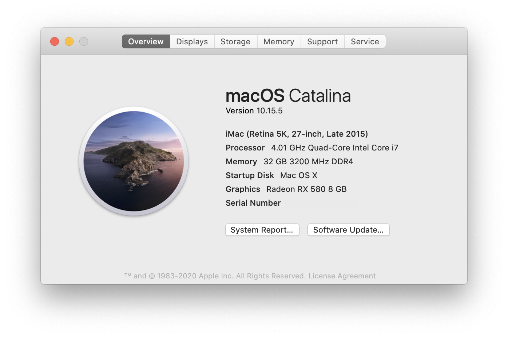

# ASUS Z170i Pro Gaming Hackintosh Tutorial
## The Clover version is deprecated now. Only [OpenCore](https://github.com/BrushXue/Z170i-Pro-Gaming-OpenCore) version will be updated in the future.
[中文版本](README_zh-cn.md)

This tutorial works perfectly on macOS Catalina (10.15.5). FCPX GPU rendering works smoothly. HDR can be enabled. Supports sleep, Airdrop and Handoff. 

## Update 5 (Last Update)
Updated to macOS Catalina 10.15.5.

Updated [Clover](https://github.com/CloverHackyColor/CloverBootloader) to r5119.

Updated all kexts to the latest version.

## Update 4
Updated [Clover](https://github.com/CloverHackyColor/CloverBootloader) to r5116.

Updated all kexts to the latest version.

Switched to [minimal-dark](https://github.com/ImmersiveX/clover-theme-minimal-dark) theme.

## Update 3
Updated [Clover](https://github.com/CloverHackyColor/CloverBootloader) to r5108. Won't update to the latest version until the theme issue is fixed.

Updated all kexts to the latest version.

Switched to pure UEFI envirionment. Check your BIOS setup with the latest table.

Fixed USB Power issue so you can charge your iPad.

## Update 2
Updated to macOS Catalina 10.15.4.

Updated [Clover](https://github.com/CloverHackyColor/CloverBootloader) to r5107 and all kexts to the latest version.

If you are updating from previous version and moved all kexts to `/Library/Extensions`, please move them back to `/EFI/CLOVER/kexts/Other` as kernel extensions are [deprecated](https://developer.apple.com/support/kernel-extensions/) by Apple since February.
## Update 1
Updated [Clover](https://github.com/CloverHackyColor/CloverBootloader) to r5104 and all kexts to the latest version.

Switched from [FakeSMC](https://github.com/RehabMan/OS-X-FakeSMC-kozlek) to [VirtualSMC](https://github.com/acidanthera/VirtualSMC).

~~(Optional) Move all kexts to `/Library/Extensions`.~~

## Hardware
| Item | Brand | Model | Driver | Comment |
|-----|-----|-----|-----|-----|
| Motherboard | ASUS | Z170i Pro Gaming | | |
| CPU | Intel | i7-6700K | | |
| RAM | G.SKILL | TridentZ 2x16GB DDR4 3000 | | Overclocked to 3200 |
| iGPU | Intel | HD Graphics 530 | built-in | Headless mode |
| dGPU | XFX | RX 580 GTS XXX Edition 8GB | built-in | 2304 SP |
| SSD | Samsung | SM961 1TB NVMe | built-in | |
| Wireless | Broadcom | BCM94360NG M.2 | built-in | QCA61x4A was replaced* |
| Ethernet | Intel | I219-V | [IntelMausi.kext](https://github.com/acidanthera/IntelMausi) | |
| Audio | Realtek | ALC1150 | [AppleALC.kext](https://github.com/acidanthera/AppleALC) | |
| PSU | Corsair | SF600 Platinum | | |
| Case | Dan | A4-SFX | | |
| Monitor | Dell | U2720Q | | |

*QCA61x4A is not supported. Follow [this guide](https://www.tonymacx86.com/threads/bcm94352z-installed-on-asus-z170i-pro-gaming-wifi-and-bt.191274) the replace the onboard wireless card. Theoretically BCM94352Z or BCM94360CS2 with adapter can work as well.
## BIOS Setup
| Name | Option |
| --- | --- |
| SW Guard Extensions (SGX) | Disabled |
| CFG Lock | Disabled |
| VT-d | Disabled |
| Above 4G Decoding | Enabled |
| Primary Display | PCIE |
| iGPU-Multi-Monitor | Enabled |
| DVMT Pre-Allocated | 128M |
| IOAPIC 24-119 Entries | Disabled |
| Network Stack | Disabled |
| Legacy USB Support| Enabled |
| Fast Boot | Disabled |
| OS Type | Other OS |
| Launch CSM | Disabled |

## Installation
### Pre Installation
Download the official macOS Catalina image, [Clover Configurator](https://mackie100projects.altervista.org/download-clover-configurator/) and [Hackintool](https://github.com/headkaze/Hackintool).

**DO NOT** use UniBeast to create the drive. It may create strange errors. And do not use MultiBeast for post installation jobs.

Follow [this guide](https://hackintosher.com/guides/how-to-make-a-macos-10-15-catalina-flash-drive-installer/) to create the boot drive. Copy my `/EFI` folder into the EFI partition of your boot drive. Also copy Clover Configurator and Hackintool into the main partition.

### During Installation 
Press F8 to boot into your flash drive. Move to **Boot macOS Install from Install macOS Catalina** and press spacebar to add -v(verbose) to display debug messages. If USB 3.0 gives error, switch to **USB 2.0**.

Before installation, first open **Disk Utility** to erase the drive. You can choose either APFS(recommended) or HFS+ with GUID partition map.

The system will auto reboot from USB for several times. In initialization page **DO NOT** connect to internet and login iCloud, Create a local account instead. Then you should be able to reach the desktop.

### Post Installation
After the first boot, open Clover Configurator to mount both EFI partitions in SSD and flash drive.

Copy everything from the EFI in flash drive to the EFI in SSD and reboot. Now you should be able to boot from SSD.

Refer to [this guide](https://hackintosher.com/forums/thread/generate-your-own-hackintosh-serial-number-board-serial-number-uuid-mlb-rom-in-clover.306) to generate serial number. Save and reboot. Then you should be able to login iCloud.

Enjoy your own Hackintosh!

## Comments
1. If your iGPU is not HD 530, refer to [this guide](https://www.tonymacx86.com/threads/an-idiots-guide-to-lilu-and-its-plug-ins.260063/#Headless) to recongnize the model correctly.
2. If you don't have a dGPU, i.e. output via iGPU, refer to [this guide](https://hackintosh.gitbook.io/-r-hackintosh-vanilla-desktop-guide/config.plist-per-hardware/skylake#properties) to modify `/EFI/CLOVER/config.plist`.
3. If your motherboard is not ASUS Z170i Pro Gaming, refer to [this guide](https://www.tonymacx86.com/threads/the-new-beginners-guide-to-usb-port-configuration.286553) to create your own USB patch.

## Known issue
GPU fan spins at max RPM for several seconds during boot occasionally and runs normally in desktop. This might be a XFX BIOS bug. You may choose any other Polaris GPUs.
