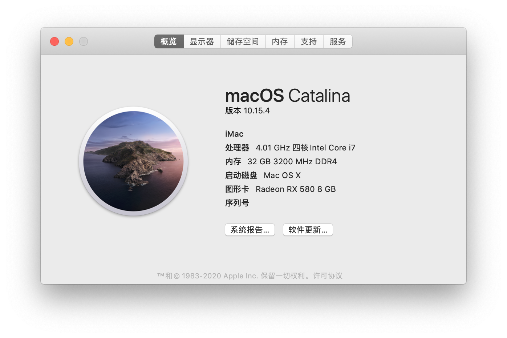
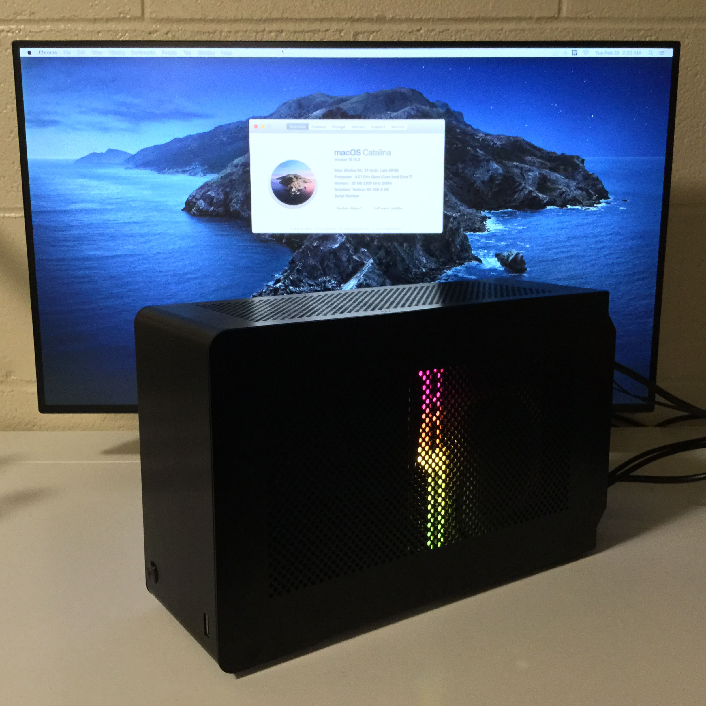

# 华硕Z170i Pro Gaming黑苹果教程
即将更新到OpenCore，目前正在测试稳定性。

本教程可在macOS Catalina (10.15.4)上完美驱动。FCPX显卡渲染正常工作。HDR可正常开启。支持睡眠，隔空投送和接力。

## 更新2
更新[Clover](https://github.com/CloverHackyColor/CloverBootloader)版本至r5108。在Clover修复主题显示错误之前不会再有更新。

更新所有kext到当前最新版本。

切换到纯UEFI环境。请根据对照表格设置BIOS。

修复USB电源问题，现在可以给iPad充电了。

## 更新2
更新至macOS Catalina 10.15.4。

更新[Clover](https://github.com/CloverHackyColor/CloverBootloader)版本至r5107，更新所有kext到当前最新版本。

如果你是从之前的版本升级，并将所有kext移动至`/Library/Extensions`下，请将它们移回`/EFI/CLOVER/kexts/Other`。苹果自今年二月起[停止](https://developer.apple.com/support/kernel-extensions/)了第三方内核扩展的使用。

## 更新1
更新[Clover](https://github.com/CloverHackyColor/CloverBootloader)版本至r5104，更新所有kext到当前最新版本。

从[FakeSMC](https://github.com/RehabMan/OS-X-FakeSMC-kozlek)切换到[VirtualSMC](https://github.com/acidanthera/VirtualSMC)。

~~(可选)将所有kext移动到`/Library/Extensions`。~~
## 硬件
| 类别 | 品牌 | 型号 | 驱动 | 备注 |
|-----|-----|-----|-----|-----|
| 主板 | 华硕 | Z170i Pro Gaming | | |
| 处理器 | 英特尔 | i7-6700K |  | |
| 内存 | 芝奇 | TridentZ 2x16GB DDR4 3000 |  | 超频至 3200 |
| 核芯显卡 | 英特尔 | HD Graphics 530 | 免驱 | Headless模式 |
| 独立显卡 | 讯景 | RX 580 GTS XXX Edition 8GB | 免驱 | 2304流处理器 |
| 固态硬盘 | 三星 | SM961 1TB NVMe | 免驱 | |
| 无线 | 博通 | BCM94360NG M.2 | 免驱 | 替换QCA61x4A* |
| 以太网 | 英特尔 | I219-V | [IntelMausi.kext](https://github.com/acidanthera/IntelMausi) | |
| 声卡 | 瑞昱 | ALC1150 | [AppleALC.kext](https://github.com/acidanthera/AppleALC) | |
| 电源 | 海盗船 | SF600 白金版 | | |
| 机箱 | Dan | A4-SFX | | |
| 显示器 | 戴尔 | U2720Q | | |

*高通的QCA61x4A无解，请参见[此教程](https://www.tonymacx86.com/threads/bcm94352z-installed-on-asus-z170i-pro-gaming-wifi-and-bt.191274)替换原厂无线网卡。理论上BCM94352Z或BCM94360CS2加转接卡都可以免驱使用。
## BIOS设置
| 名称 | 选项 |
| --- | --- |
| SW Guard Extensions (SGX) | 关闭 |
| CFG Lock | 关闭 |
| VT-d | 关闭 |
| 大于4G地址空间解码 | 开启 |
| 首选显卡 | PCIE |
| 初始化iGPU | 开启 |
| DVMT Pre-Allocated | 128M |
| IOAPIC 24-119 Entries | 关闭 |
| 网络堆栈 | 关闭 |
| Legacy USB 支持| 开启 |
| 快速启动 | 关闭 |
| 操作系统类型 | 其他操作系统 |
| 开启CSM | 关闭 |

## 安装
### 安装前
下载官方镜像，[Clover Configurator](https://mackie100projects.altervista.org/download-clover-configurator/)和[Hackintool](https://github.com/headkaze/Hackintool)。

**不要**使用UniBeast创建启动盘，会产生奇怪的错误。也不要使用MultiBeast做安装后处理工作。

参考[此教程](https://hackintosher.com/guides/how-to-make-a-macos-10-15-catalina-flash-drive-installer/)创建USB启动盘，将我的`/EFI`文件夹复制到U盘的EFI分区中。将Clover Configurator和Hackintool复制到主分区中。

### 安装过程
开机按F8从U盘启动。移动到**Boot macOS Install from Install macOS Catalina**按空格选择-v(verbose)显示调试信息。如果USB 3.0报错，请更换至USB 2.0端口。

安装Catalina前进入**Disk Utility**擦除固态硬盘。你可以选择APFS(推荐)或HFS+格式，并选择GUID分区表。

系统会自动从U盘启动数次，不要拔掉U盘。在初始化界面不要连接互联网并登录iCloud，而应创建一个本地账户，并进入桌面。

### 安装后
第一次正式启动后，打开Clover Configurator，加载固态硬盘和U盘的EFI分区。将U盘EFI分区中的所有文件复制到固态硬盘EFI分区中并重启，就可以从SSD启动了。

参考[此教程](https://hackintosher.com/forums/thread/generate-your-own-hackintosh-serial-number-board-serial-number-uuid-mlb-rom-in-clover.306)生成序列号。保存并重启。你应该可以正常登录iCloud。

现在你拥有属于你自己的黑苹果了！

## 备注
1.如果你的核心显卡不是HD 530，请参考[此教程](https://www.tonymacx86.com/threads/an-idiots-guide-to-lilu-and-its-plug-ins.260063/#Headless)修改型号。

2.如果你没有独立显卡（核显输出），参考[这里](https://hackintosh.gitbook.io/-r-hackintosh-vanilla-desktop-guide/config.plist-per-hardware/skylake#properties)修改`/EFI/CLOVER/config.plist`.

3.如果你的主板不是ASUS Z170i Pro Gaming，请参考[此教程](https://www.tonymacx86.com/threads/the-new-beginners-guide-to-usb-port-configuration.286553)创建你自己的USB补丁。

## 已知问题
显卡风扇在启动画面时有概率满速几秒，进入桌面后正常。可能是讯景BIOS的bug。可选择其他的Polaris架构显卡。

## 最终效果图

